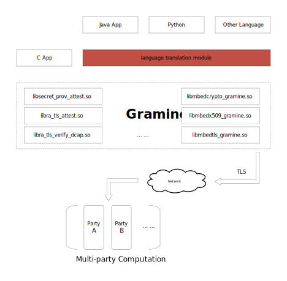
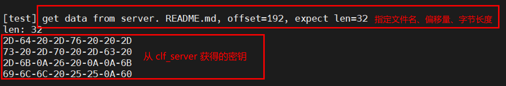

# **概述**
本文介绍在Intel® SGX使能的平台，部署基于Gramine的跨语言框架（Cross languages framework）的技术架构和使用流程。<br><br>

## 背景信息
Gramine 库是 C 语言模块，因此非 C 编程语言如 java 或 python 在使用 Gramine 时不容易进行 SGX 远程认证，同时也不容易在不信任节点（clf_client / 运行 SGX enclave 的地方）和信任之间传输密钥/数据节点（clf_server）。该框架旨在简化非 C 语言编程应用中的开发。

SGX是Intel推出的机密计算技术，Gramine是主要的SGX libOS。用户可以在 Gramine 上开发机密代码。问题在于，Gramine 是用 C 语言编写的，而 Gramine SDK 是 Linux 的“.so”库。因此，像 Java 这样的编程语言无法直接调用这些库来进行远程认证和传输数据。这使得这些非 c 开发人员难以使用 Gramine，并最终难以在他们的项目中使用 SGX。要调用 Gramine，他们需要开发一个语言翻译模块，如上图中的红框。clf可以解决多语言的开发问题。

## 技术架构
本实践技术架构如下所示。



本实践涉及两个角色：clf_client端、clf_server端。

- **clf_client**：运行 SGX enclave 的中央机器。密钥和数据将通过 TLS 加密通道传输到本机。

- **clf_server**：它包含将传输给客户端的数据和密钥。 clf_server 可能将部署多个，尤其是在多方机密计算场景下。

该框架为用户App提供了3个功能：
1. 获取数据加解密密钥，可能在后续流程中使用；
2. 从clf_server 获取各种数据资源。这些数据资源是 clf_server 的特定文件夹中的文件。该框架提供了Linux中文件读写等API。用户应用程序可以像读取本地文件一样轻松获取数据，指定偏移量和长度；
3. 把结果放到远程的clf_server 中，就像Linux 中写入本地文件一样。

clf_client 运行在不信任的环境中，例如在 CSP 公共云中，因此使用 SGX 来确保机密计算。 clf_server 在密钥/数据/结果所在的用户信任环境中运行。 clf_client 和 clf_server 之间的密钥/数据/结果传输受 TLS 安全通道保护。

 clf_server 的每个操作目标都将使用 SGX 远程证明进行验证。如果通过了远程认证（即clf_server信任clf_client），那么clf_server会将密钥/数据发送给clf_client或者接受clf_client的结果。

这个框架的职责是为非c语言提供一种简单安全的数据传输方式，但它并不关心如何使用这些数据。它让用户应用程序可以自由判断如何使用这些数据并根据需要放置结果。

架构说明：

* ① 用户应用程序（例如，Java）调用特定语言的接口（获取密钥/获取数据）
* ② 特定语言接口调用clf_client lib
* ③ clf_client lib 通过 TLS 安全通道从 clf_server 获取密钥或数据。这可能在数据中心之间。 clf_server 通常部署在用户的私有网络中
* ④ clf_server检查客户端SGX签名，并按要求向客户端传输密钥或数据
* ⑤ Client App 客户特定逻辑使用先前从 clf_server 获得的密钥解密从 clf_server 获得的数据
* ⑥ Client App通过clf_client lib将结果推送回服务器
* ⑦ clf_server 将结果保存在文件系统中

部署架构中，使用到的主要组件如下：
* **LibOS**：Gramine是一款轻量级LibOS，基于Intel SGX加密技术，提供内核能力定制，可降低资源运行消耗，提供良好的ABI兼容性和可移植性，应用程序无需修改或者仅进行极小改动便能运行在SGX环境中，显著降低原生应用移植到SGX环境的成本。更多信息，请参见[Gramine](https://github.com/gramineproject/gramine)。
* **Docker容器引擎**：为了方便部署推理服务，本实践将两个角色部署在同一台机器，通过Docker的命令方式运行在container中。


1. 执⾏以下命令，下载本实践所使⽤到的代码。
    ```shell
    git clone https://github.com/intel/confidential-computing-zoo.git

    git clone https://github.com/gramineproject/gramine.git
    ```
2. 进⼊tools⽬录，获取证书<p></p>
    执⾏ `cd <clf>/cross_lang_framework/tools` 命令，切换⾄tools⽬录，使用脚本生成证书，证书将用于多方机密计算场景下的认证。
    使用 -r 参数生成根证书（例如 ca_cert.crt），用于 clf_client。
    ```shell
    ./gen_cert.sh -r
    ```
    使用 -c 参数生成子证书和私钥，在 clf_server 中使用。
    ```shell
    ./gen_cert.sh -c
    ```
    用户需要在执行`./gen_cert.sh -c`命令生成证书时在 Common Name 一项时填写部署server_clf的`clf_server_domain_name`


3. 构建 clf_server 镜像和 clf-client-app 镜像<p></p>
   执⾏ `cd ../docker` 命令，切换⾄docker⽬录<p></p>
   其中的clf-client-app为示例应用，用户可参考示例应用，自行编译到不同的应用中<p></p>
   用户可通过以下两种途径获取镜像。

    i) 下载已构建的镜像

    ```shell
    docker pull intelcczoo/clf:bytedance_clf-server
    docker tag intelcczoo/clf:bytedance_clf-server clf-server:gramine1.3-ubuntu20.04

    docker pull intelcczoo/clf:bytedance_clf-client-app
    docker tag intelcczoo/clf:bytedance_clf-client-app clf-client-app:gramine1.3-ubuntu20.04
    ```

    ii) 自行编译镜像<p></p>
    自行编译时请注意将PCCS访问地址配置为火山引擎提供的专有地址。
    ```shell
    ./build_clf_server_docker_image.sh

    ./build_clf_client_docker_image.sh
    ./build_clf_client_app_docker_image.sh
    ```
    > 说明： 在 clf-client-app 镜像构建期间,请记录下 clf-client-app 的测量值。这些测量值将在启动服务时使用。<p></p>
    > 以下是示例的测量值<p></p>
    > Attributes:<p></p>
    > mr_enclave:  34084a5b239a00236550f579e7b639e23cd729a09cf33d36778280a2082566a5<p></p>
    > mr_signer:   6fc83bdb60f1300639a0d407cb0e9ef143448e42479f6e4db947a4ae1aaca5d1<p></p>

4. 部署clf-server服务

    执⾏命令，启动并进入clf-server容器。
    ```shell
    ./start_clf_server_container.sh <clf_server_ip_addr>
    ```
    用户可以通过两种方式配置参数，并启动 clf-server 服务

    i) 通过配置``clf_server.conf``文件，定义启动参数。

    其中的`MRSigner`和`MREnclave`参数为用户在构建clf-client-app镜像时所记录的 mr_enclave 值，和 mr_signer 值。
    其中的 `secret`为用于加密数据的密钥，`port`表示数据使用的端口。
    ```shell
    RA_TLS_ALLOW_DEBUG_ENCLAVE_INSECURE=1 \
    RA_TLS_ALLOW_OUTDATED_TCB_INSECURE=1 \
    ./clf_server &
    ```
    ii) 通过命令，自行定义参数值
    ```shell
    ./start_clf_server_container.sh <hostname_ip_addr>

    RA_TLS_ALLOW_DEBUG_ENCLAVE_INSECURE=1 \
    RA_TLS_ALLOW_OUTDATED_TCB_INSECURE=1 \
    ./clf_server -S -E -d -v  -s -p -c -k
    &
    ```
    > -S 表示MRSigner的值，<p></p>
    > -E 表示MREnclave的值，<p></p>
    > -d 表示isv_prod_id的值，<p></p>
    > -v 表示isv_svn的值，<p></p>
    > -s 表示用于加密数据的密钥，<p></p>
    > -p 表示数据使用的端口/key传输，<p></p>
    > -c 表示secret cert路径，<p></p>
    > -k 表示私钥路径。

    **说明**：如果用户没有给出参数，应用程序将读取该目录下的``clf_server.conf``文件以获取所有这些值。<p></p>
    如果用户想自行定义这些参数值，可以参考以下这样的命令
    ```shell
    RA_TLS_ALLOW_DEBUG_ENCLAVE_INSECURE=1 RA_TLS_ALLOW_OUTDATED_TCB_INSECURE=1 ./    clf_server 
    -S0a85b393078ee06dafc58d6692a7a59bee27fdce2b70ae45730b501af6ae290a -E -d0 -v0 
    -s58a7129dc07ba462ca8317d578a3d7cb -p4433 -ccerts/server_signed_cert.crt -kcerts/    server_private_key.pem
    ```

5. 部署 clf-client-app 端访问<p></p>
    执⾏ `cd <clf>/cross_lang_framework/docker` 命令，切换⾄docker⽬录
    ```shell
    ./start_clf_server_container.sh <clf_server_ip_addr> <clf_server_domain_name>
    ```
    `clf_server_ip_addr`为部署 clf_server 的ip地址，执行 clf-client-app 端的推理
    执行推理
    ```shell
    gramine-sgx java -Xmx3G clf_test <clf_server_domain_name>
    ```
    clf-client端打印推理信息。
    
